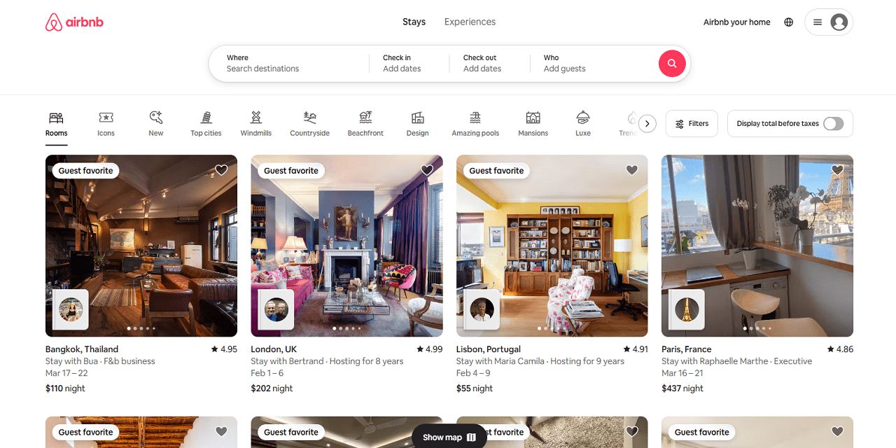

<p align="center">
  <a href="#" target="blank">
    
  </a>
</p>

# pinksl.ip

Social Media Landing Page - Next.js + GraphQL + Firebase

[](https://www.typescriptlang.org/docs/handbook/2/everyday-types.html)
[](https://react.dev/learn/start-a-new-react-project)
[](https://nextjs.org/docs/getting-started/installation)


## Setup

```sh
$ git clone https://github.com/2gbeh/pinksl.ip.git
$ cd pinksl.ip
```

#### Client Setup

```sh
$ cd web
$ npm cache clean --force
$ npm install
# OR npm install --legacy-peer-deps

TODO: Update .env credentials

$ npm run dev
```

> Client: http://localhost:3000

#### Server Setup

```sh
$ cd api
$ npm cache clean --force
$ npm install
# OR npm install --legacy-peer-deps

TODO: Update .env credentials

$ node server.js
```

## Usage

> Server: http://localhost:4000

## Documentation

Coming soon

## Screenshots

<!--  -->

Coming soon
